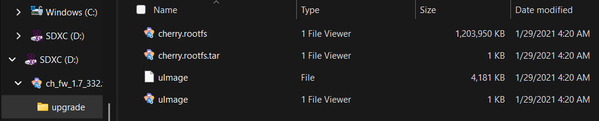
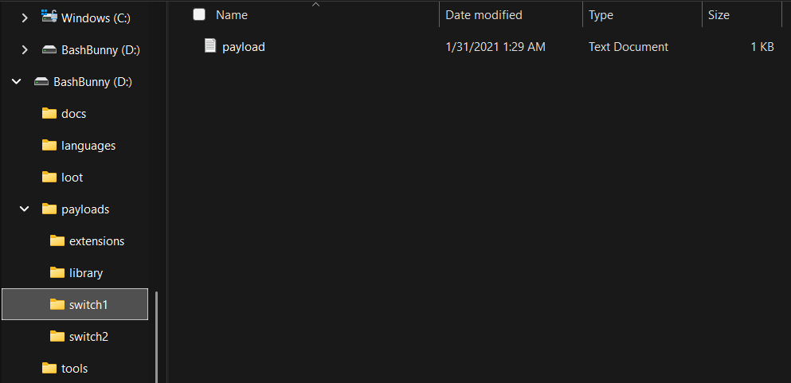

# Bash Bunny MKII #
*This device tricks computers by emulating a variety of USB devices such as keyboards, network adapters and storage drives. By deploying pre-written payloads in an insertable MicroSD chip, specific tasks can be forced onto another device. These payloads can trick computers into installing backdoors, network attacks and exfiltrating documents.*

If anybody gets confused, the link to the official Bash Bunny help page is right here:
[Bash Bunny Help](https://docs.hak5.org/bash-bunny/bash-bunny-by-hak5/)

## Steps to setting up the Bash Bunny MKII correctly ##

*Before looking into and executing attacks, we need to download the latest firmware onto the Bash Bunny. Thankfully, these steps are super simple.*

We need 2 specific pieces of hardware for this:
- Bash Bunny MKII
- MicroSD card

**Insert the MicroSD card into your device for the download.** 

Dowload the latest firmware from this page:
[Bash Bunny MKII Firmware](https://downloads.hak5.org/bunny/mk2)

- Once downloaded from the site, move it into the MicroSD card from your file browser.
- When done transferring into the file, extract the MicroSD card from your file system (For safety).
- Remove the MicroSD card from your device.

*The file should look something like this in your MicroSD*

- Insert the MicroSD into the Bash Bunny MKII
- Insert the Bash Bunny MKII into the device
- Wait for the files to download onto the Bash Bunny
  - This could take some time. 2-5 minutes
  - The download is indicated by the LED lights on the device

|LED|Meaning|Should I unplug?|
|---|---|---|
|Green|Booting up|Safe to unplug|
|Blue|Arming mode|Safe to unplug|
|Red|Recovery mode or firmware flashing|Do NOT unplug|
|Red/Blue alternating|Recovery mode or firmware flashing|Do NOT unplug|

Once the LED indicates the download was succesful, your Bash Bunny MKII should contain these files:

*Payload should not be present just yet, we'll get into that soon*

## Practice attacks ##
---
*We will be going over 2 extremely simple attacks to start you off*
*More complicated attacks can be found through the Hak5 website*

## First Attack: Notepad String ##
*The attack*

`ATTACKMODE HID`
`LED B SLOW`
`QUACK DELAY 1000`
`RUN WIN notepad.exe`
`QUACK DELAY 3000`
`QUACK STRING Hello World!!!`
`QUACK DELAY 1000`
`QUACK ENTER`
`QUACK STRING Bye World...`
`QUACK DELAY 3000`
`QUACK CTRL a`
`QUACK BACKSPACE`

*It's important to understand what each command does, so we'll walk through the purpose of each line*

`ATTACKMODE HID`
- Acts as a USB Keyboard
- tricks the device into giving access to the Bash Bunny

`LED B SLOW`
- Makes the LED on the Bash Bunny blink blue slowly
- Important for understanding if it's running or not
  
`QUACK DELAY 1000`
- Waits 1000 milliseconds (1 second)
- Gives the computer time to recognize the device

`RUN WIN notepad.exe`
- This opens the dialog box
- Then types and runs powershell

`QUACK DELAY 3000`
- Waits another 3000 milliseconds (3 seconds)
- Important to give notepad time to boot

`QUACK STRING Hello World!!!`
- Types the words Hello World!!! into the notepad

`QUACK DELAY 1000`
- Waits 1000 milliseconds (1 second)
- Gives the computer time to print the string

`QUACK ENTER`
- Goes to the next line

`QUACK STRING Bye World...`
- Types the words Bye World... into the notepad

`QUACK DELAY 3000`
- Waits 3000 milliseconds (3 seconds)
- Admire your work!
  
`QUACK CTRL a`
- Highlights everything that has been written

`QUACK BACKSPACE`
- Deletes everything

## Second Attack: Command Line Execution ##

*It's important to understand what each command does, so we'll walk through the purpose of each line*

`ATTACKMODE HID`
- Acts as a USB Keyboard
- tricks the debvice into giving access to the Bash Bunny

`DELAY 3000`
- Waits 3000 milliseconds (3 second)
- Gives the computer time to recognize the device

`GUI r`
- Simulates opening the dialog box
- win + r

`DELAY 500`
- Waits 500 milliseconds (0.5 seconds)
- Gives the computer time to open the dialog box

`STRING notepad`
- Types notepad in the dialog box

`ENTER`
- Enters string

Writes in the notepad and adds a new line
STRING Bash Bunny payload executed
ENTER

---

## Troubleshooting ##

*The target device will most likely have defenses against unknown USBs, so the attack may not run.*

To avoid this we will check permissions.

Must disable in removable storage access.
Make sure group policy editor is installed on your computer

- Win + r
- gpedit.msc
- Make sure it is installed

Removable Disks: 
- Deny execute access
- Deny write access

this is important since it will

how to interpret its output

explains everything needed to understand its use and output

how to detect it

## Possible Prevention Options ##
*There are multiple prevention techniques but it's important to remember that there is no perfect defense. Due to the way Bash Bunny MKII operates, many concrete defenses feature USB restrictions, policy, and endpoint protection.*

---
#### Disable or restrict unused ports ####
- Disable USB ports in BIOS/UEFI
- Use Group Policy or endpoint security tools to block unauthorized USB devices

#### Block or Monitor HID Devices ####
(Bash Bunny can act as a Human Interface Device (HID) to inject keystrokes like a keyboard)
- Block new keyboard devices from being added
- Use endpoint security tools for detecting strange keystroke activity

#### Network Adapter Monitoring ####
(Bash Bunny can emulate a USB Ethernet adapter and route traffic through itself)
- Monitor unusual DHCP or network interface changes
- Block automatic installation of new network adapters

#### Physical Security & User Training ####
- Teach users to avoid plugging in unknown USB drives
- Lock screens when leaving a workstation
---

