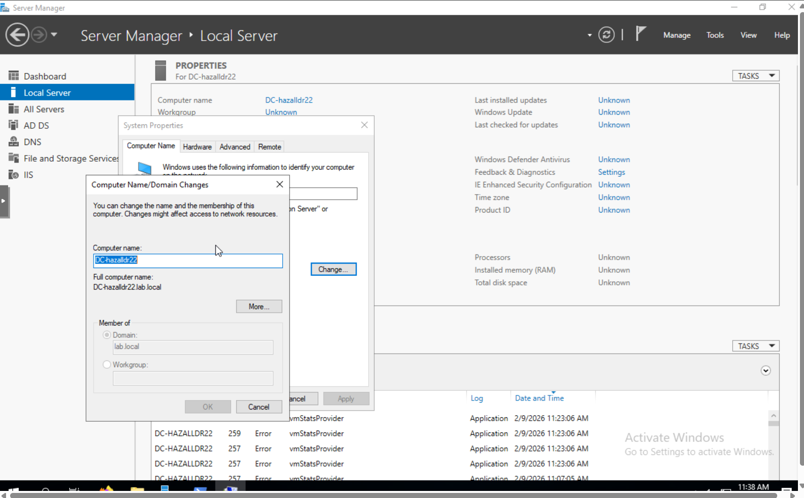

#Changing your Domain Controller name#

The following is a simple 2-3 minute tutorial on changing the domain name of your Domain Controller.

###*Step 1:*###
1. Navigate to vl.sbu.edu:8006.
2. Once signed in, log into your Domain Controller using the normal sign in.

###*Step 2:*###
1. Locate Server Manager on the task bar.
2. Click on the Local Server side menu.
3. Find and click the computer name option. (It should be the first one)
4. Once in the Computer Name properties, click on the box that says Change (Ignore the pop-up and click Ok).
5. Change your DC name to: DC-(Your Bonaventure Username)

**Once you get to this step, it should look something like this**

