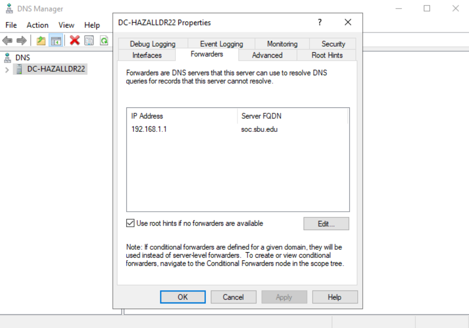

# Changing your Domain Controller name #

The following is a simple 2-3 minute tutorial on changing the domain name of your Domain Controller.

### *Step 1:* ###
1. Navigate to vl.sbu.edu:8006.
2. Once signed in, log into your Domain Controller using the normal sign in.

### *Step 2:* ###
1. Locate Server Manager on the task bar.
2. Click on the Local Server side menu.
3. Find and click the computer name option. (It should be the first one)
4. Once in the Computer Name properties, click on the box that says Change (Ignore the pop-up and click Ok).
5. Change your DC name to: DC-[Your Bonaventure Username]

**Once you get to this step, it should look something like this**

6. Once your name is correct, hit Ok.
7. It should then take you back to the properties screen. From there just hit apply and then Ok.
8. Restart your vm computer.

### *Step 3:* ###
1. Click on the Tools dropdown located at the top right of Server Manager.
2. Find the DNS subsection and click on it.
3. Right click on your computer name. It should resemble: DC-[Your Bonaventure Username]
4. Go into properties and click on Forwarders.
5. We want the IP address to be 192.168.1.1 (If it says anything else simply delete it)
   - Click on the Edit box
   - Delete any other IP address listed
   - Change the IP address to 192.168.1.1
   - Click Ok
   - Click Apply and then Ok

**If you're having any trouble, this is what the forwarders section should look like**

