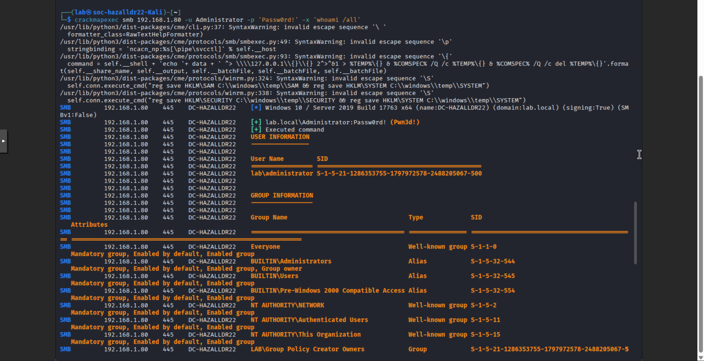
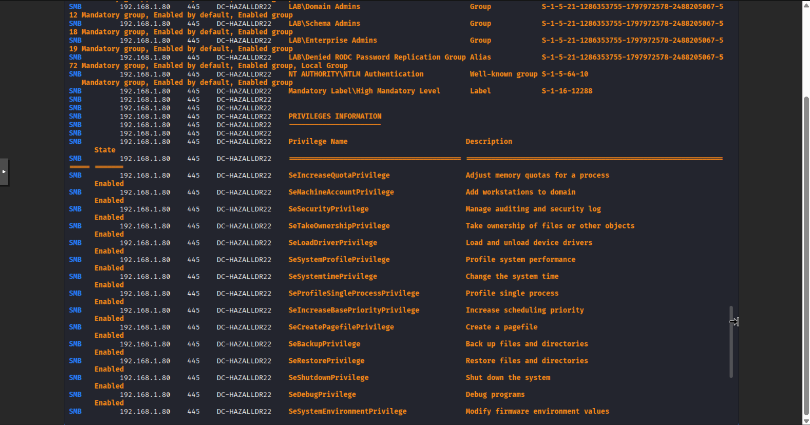
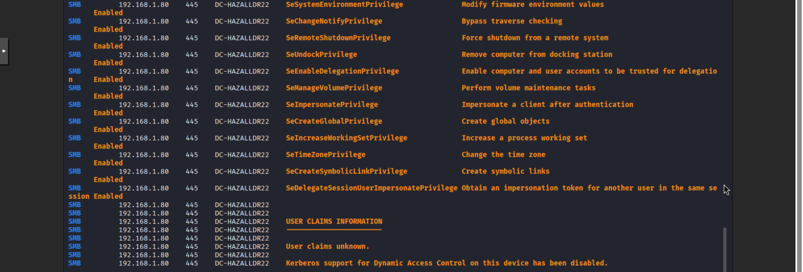

# Identifying Lateral Movement #
The following goes through a simple attack that identifies privilages on another device.

### *Step 1: The Attack (From Kali VM)* ###
Navigate to the Kali VM and run this remote command on the DC:

`crackmapexec smb <DC_IP> -u Administrator -p 'Passw0rd!' -x 'whoami /all'`

#### What does this command do when broken down? ####

*
The security tool:
1. crackmapexec
   - Post-exploitation tool commonly used in penetration testing
   - Legitimate uses:
      - U
   - Illegitimate uses
      -
*

Required entries for crackmapexec:

2. smb 
   - Shows the protocol that is being used
   - Is the Windows file-sharing and remote administration protocol.
   - 
3. <DC_IP>
   - The target DCs IP address
   - In my case, my test DCs IP is 192.168.1.80
   - Important since the command needs a location to target
4. -u Administrator
   - Specifies the user being targeted
   - The command needs a specific user to authenticate as
   - Administrator is the intended user
5. -p 'Passw0rd!'
   - Specifies the password to the targeted account
   - Login will fail without proper credentials
   - Passw0rd! is the password for Administrator
6. -x 'whoami /all'
   - 

Once the command runs, the output should look similar to this:

### *Step 2: Evidence Investigation (On DC VM)* ###
Event ID 4624 (Security Log): Successful Network Logon (Type 3). Identify the Source Network
Address (Kali IP).
Event ID 4688 (Security Log): Process Creation for whoami.exe .
Event ID 1 (Sysmon Log): Detailed Process Creation. Locate the CommandLine field to see
