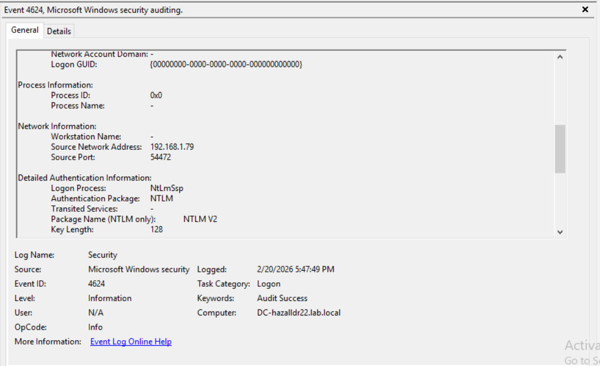
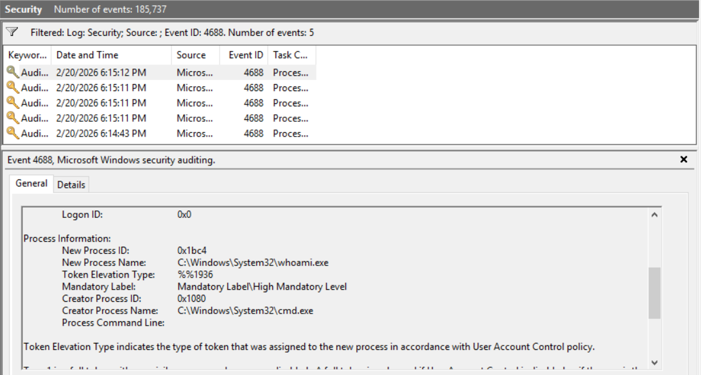

# Identifying Lateral Movement #
The following goes through a simple attack that identifies privilages on another device.

## *Step 1: The Attack (From Kali VM)* ##
Navigate to the Kali VM and run this remote command on the DC:

`crackmapexec smb <DC_IP> -u Administrator -p 'Passw0rd!' -x 'whoami /all'`

---

#### What does this command do when broken down? ####

The security tool:
1. crackmapexec (CME)
   - Post-exploitation tool commonly used in penetration testing
- Legitimate uses:
   - Checking for weak credentials and password reuse
   - Red team testing for real attacker simulation
   - Blue team validation for tool verification and confirming that logging works
- Illegitimate uses:
  - Executing malicious payloads
  - Gaining Domain access

---

#### Required entries after crackmapexec: ####

2. smb 
   - Determines the protocol to use
   - Is the Windows file-sharing and remote administration protocol.
   - Typically port 445
3. <DC_IP>
   - The target DCs IP address
   - In my case, my test DCs IP is 192.168.1.80
   - Important since the command needs a location to target
4. -u Administrator
   - Specifies the user being targeted
   - The command needs a specific user to authenticate as
   - Administrator is the intended user
5. -p 'Passw0rd!'
   - Specifies the password to the targeted account
   - Login will fail without proper credentials
   - Passw0rd! is the password for Administrator
6. -x 'whoami /all'
   - tells CME to execute the command remotely
   - whoami /all is the command being executed
   - The command outputs certain information about the security context of the logged-in account

*Once the command runs, the output should look similar to this:*

## *Step 2: Evidence Investigation (On DC VM)* ##

### Where the logs are located in *Event Viewer* ###
- Windows Security Log: Windows Logs -> Security
- Sysmon Operational Log: Applications and Services Logs -> Microsoft -> Windows ->
Sysmon -> Operational

*An example Event Viewer page with an open Event log should look something like this:*

#### Event ID 4624 (Security Log) ####

*Used to record succesful authentication*

*It records a network logon which is normal for smb authentication*

---

##### Fields that connect to the event: #####

: Indicates network login

: Shows what account authenticated

   - Shows the Kali IP as the source

: Shows protocol used

---

#### Event ID 4688 (Security Log) ####

#### Event ID 1 (Sysmon Log) ####

