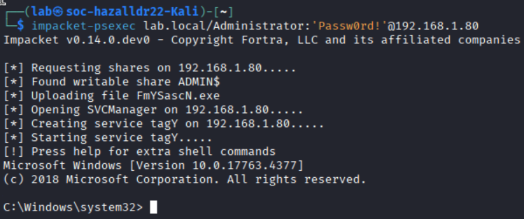
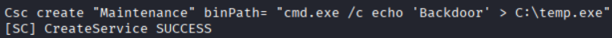
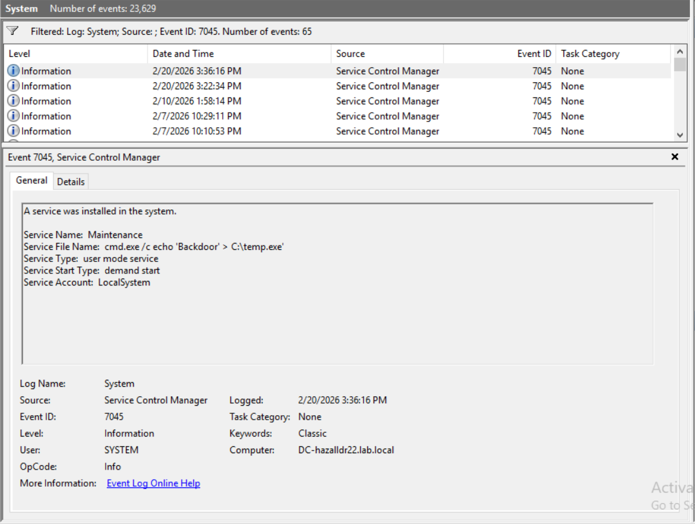
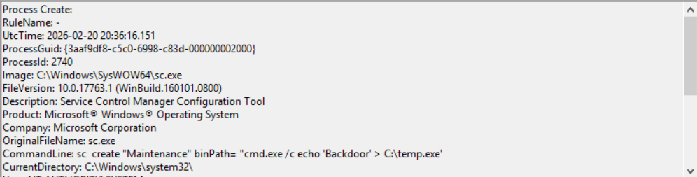
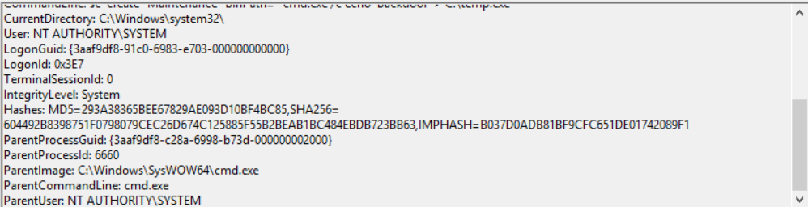

# Detecting persistence through malicious service creation #
The following goes through an attack process of creating a system service that allows access after system reboots.

## *Step 1: The Attack (From Kali VM)* ##
Navigate to the Kali VM and run this remote command on the DC:

`impacket-psexec lab.local/Administrator:'Passw0rd!'@<DC_IP>`

---

#### What does this command do when broken down? ####
Lets start with the command that opens the shell.

The security tool:
1. impacket-psexec
   - Python based use of Microsofts PsExec functions
   - allows remote command execution and shell access
- Legitimate uses:
   - Attacker simulations and compromise scenarios
   - Executing diagnostic commandss when physical access is unavailable
- Illegitimate uses:
  - Remotely executing ransomware or malware
  - Using persistence to hide malicious code as legitimate services

---

#### Entries after impacket-psexec: ####

2. lab.local
   - Specifies the targeted Domain name
   - Required for creating a temporary service inside of the DC
3. /Administrator
   - The forward slash connects the user to the domain name
   - Specifies the user being targeted
   - The command needs a specific user to authenticate as
5. :'Passw0rd!'
   - The colon shows where the username ends and where the password starts
   - Passw0rd! is the password for Administrator
   - Login will fail without proper credentials
6. @<DC_IP>
   - The @ separates credentials from target
   - The target DCs IP address
   - In my case, my test DCs IP is 192.168.1.80
   - Important since the command needs a location to target
Overall, this command does the following:
   - Authenticates over SMB using adequate credentials
   - creates a temporary service
   - starts the service
   - offers an interactive SYSTEM shell

*It is essential that after running, you are put into the DC shell. Once the command runs, the output should look similar to this:*

#### When inside the newly created remote shell, run: ####

`sc create "Maintenance" binPath= "cmd.exe /c echo 'Backdoor' > C:\temp.exe"`

---

#### What does this command do when broken down? ####

The security tool:
1. sc
   - Stands for Service Control utility
   - Used for creating, deleting, starting, and stopping services
- Legitimate uses:
   - Installing and managing services
   - Configuring background applications
- Illegitimate uses:
  - Setting up backdoor services
  - Attempts at escalating service privilege

---

#### Entries after sc: ####

2. create "Maintenance"
   - Creates a decoy service named Maintenance
   - Exists in Windows
3. binPath=
   - Specifies what file the service will run
5. "cmd.exe 
   - cmd.exe tells the service to run command prompt
6. /c echo 'Backdoor'> C:\temp.exe"
   - /c tells the DC command prompt to run a command and terminate
   - 'Backdoor' is the text to be written
   - > C:\temp.exe is the file that the text will go into

Overall, this command does the following:
   - Opens the Domain Controller command prompt
   - Writes 'Backdoor' into a temp file
   - Then exits

*Once the command runs, the output should look similar to this:*

## *Step 2: Evidence Investigation (On DC VM)* ##

### Where the logs are located in *Event Viewer* ###
- Windows Security Log: Windows Logs -> Security
- Sysmon Operational Log: Applications and Services Logs -> Microsoft -> Windows ->
Sysmon -> Operational

*An example Event Viewer page with an open Event log should look something like this:*

### Event ID 7045 (System Log) ###

---

*Records new service installation*

*Using sc create and PowerShell*

#### Fields that connect to the event: ####

|Field|What to look for|Why does this matter?|
|---|---|---|
|Service Name|Maintenance|Confirms the service was created|
|Service File Name|cmd.exe /c echo 'Backdoor' > C:\temp.txt|Shows the path being targeted|
|Service Type|User mode Service|Is being run as a normal Windows process|
|Service Start Type|Demand start|Windows was made to start, rather than auto-starting|

*Event Viewer proof:*

---

### Event ID 1 (Sysmon Log) ###

---

**

*Using sc create and PowerShell*

#### Fields that connect to the event: ####

|Field|What to look for|Why does this matter?|
|---|---|---|
|Service Name|Maintenance|Confirms the service was created|
|Service File Name|cmd.exe /c echo 'Backdoor' > C:\temp.txt|Shows the path being targeted|
|Service Type|User mode Service|Is being run as a normal Windows process|
|Service Start Type|Demand start|Windows was made to start, rather than auto-starting|

*Event Viewer proof:*

---
